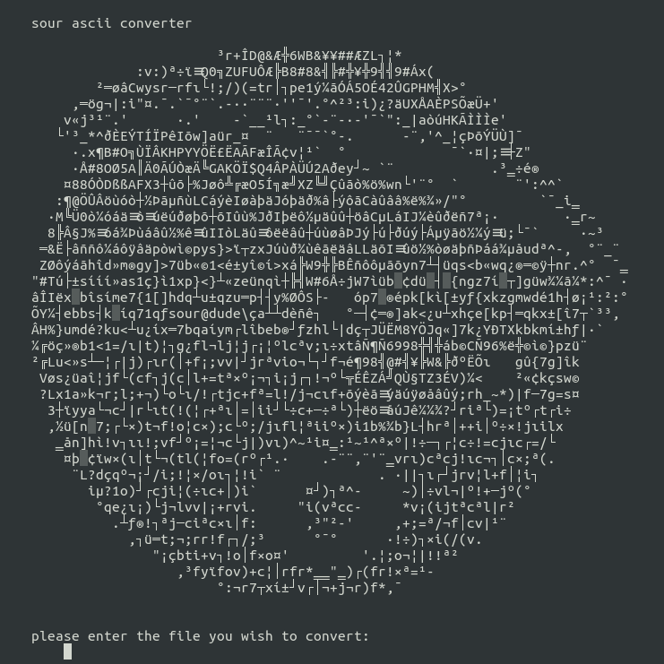

# ascii-converter
converts images to random ascii text

## Usage
Run the program from the console. The first argument should be the file path. Relative files are supported.

Optionally, you can add a second argument to redirect output to another file. Simply enter the file path you wish to write.

If you do not add arguments, you will be prompted for them.

## Installation
Download [here](http://sourdu.de/windows-ascii-converter.zip) for Windows. For other operating systems, simply
> git clone https://github.com/joshbtay/ascii-converter.git
> 
> cd ascii-converter
> 
> python ascii-converter.py

If you are not on Windows, make sure you have the dependencies installed.

## Dependencies
If you are not on windows, you will need to install the following if not already installed:

[python 3](https://www.python.org/downloads/)

[pillow](https://pillow.readthedocs.io/en/stable/installation.html)

[numpy](https://numpy.org/install/)

## input.txt
You can control how the program maps pixels to characters by editing input.txt. By default, the file looks like this:

>.,`'-¯°¨·
>
>^*~"_:¤‗¹³²
>
>cfijlortv()=+|/;!תº¬¡│┐└─ı┘┌¦÷
>
>abdeghkmnpqsuwxyzüéïîçìí?><[]{}17ƒ¿®«»░┤©¢┴┬═±
>
>CIJLâäàåãêëèôöòûùÿýáóõúñµ%ðø½¼¾├┼þÞ≡
>
>ADEFGHKNOPQRSTUVXYZ$02345ÇÄÃÅÁÂÀÉæÖÜ£ØÐÊËÈÍÌÎÏÓßÔÒÕÚÛÙݧ╝╗╚╔╩╦║
>
>M689#@&WBÆÑ╣¥╠╬¶

Character rows are sorted by lightest (such as .,'`) to heaviest (such as 8#╬¶). You can add or remove rows, and add or remove any characters. The program randomly picks a character from the corresponding row.
